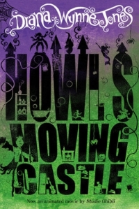

A personal favourite, *Howl's Moving Castle* by Diana Wynne Jones is an incredible children's story following the adventures of Sophie, a hatter cursed with old-age by a witch, seeking a remedy in the home of reputed scoundrel and sorcerer Howl. So why is it that on the surface, such an unusual story had such a blunt typeface? Because, like the story itself, a seemingly simple concept can evolve into something far greater with the right details.

The author name on the cover is an extravagant typeface; all swirls and overdrawn lines. The contrast is minimal but noticeable with an unusual style of serifs where, rather than the usual line, there are oversized swirls and loops. Those without these flourishes instead have curved indentations. Combining these features creates a fantastical novelty typeface that draws attention and provides incredible contrast against all others features of the cover without seeming incongruous.

Yet the true star of the cover is not the intriguing and bewitching colour gradients, or the curling author name, or even the bold title- it is instead the excisions and additions to the title that provide intrigue to an otherwise standard typeface.

Turrets with smoke curling out, Michael and Sophie running through in seven-league-bucket-boots, the looming presence of the scarecrow intersecting twos rows of type, and a reaching mermaid for an apostrophe. While incredibly random, each gives insight to the plot and therefore draws the casually-glancing-browser into the story itself. The details of the typeface itself are inconsequential when compared to the details around and within.

Many typefaces will use the negative space (counters) in letters as part of the style. The size and shape adds to the character and tone of that the fonts within the type family. They eat into line width to impact contrast, change the shape of the font through its "empty" regions. Yet the negatives on this cover differ greatly from those typical of letters. They do not shape the letters; they add contrast to it. All of details that make the title font interesting are those pieces that are cut out to reveal the graduated background- Howl's guitar and skull, the infamous bathtub, the spiders and cobwebs that have to be chased out the house/castle.

So while the focal point of this cover is the text overwhelming it, it is not the typeface that entrances the audience. It is the negative space and additions that invite further inspection, rather than the shape of the letters themselves.

Image (originally sourced from Studio Ghibli's film adaptation) is available at http://www.gablescinema.com/events/howls-moving-castle/