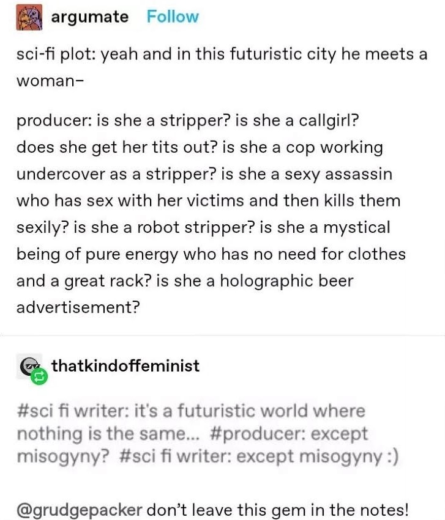

There has been a growing demand for representation in literature, especially in genre fiction where dragons and spaceships are often deemed more realistic than a happy same-sex couple. So beginning the *Wayfarer* series was a welcome change.

Reading *The Long Way to a Small Angry Planet* was not planned. Nor was it the book I expected, and for that I am grateful. Although I had seen it many times over the years in digital shops, I had written it off as another book about how Earth was crumbling around us and the eventual, inevitable demise of humanity based on the title. Instead, it is an interplanetary, intersectional, intriguing science fiction. But it is not the plot separating this novel from its genre contemporaries and predecessors; it is the characters Chambers introduces her audience to.

The first of the *Wayfarer* series has the tone of a classic science fiction. A new person joins a ship for mysterious reasons before embarking on a long quest through space with their interspecies crew, encountering aliens and escaping danger to reach their goal. This is the plot of many a sci-fi novel and film.

So what sets this apart from other novels? It certainly isn't the interspecies interactions. The post below is amusing in how typical it can be in the genre and reveals a common problem in the films.

I had a similar thought upon reading the first conversation in the book- featuring an immediate introduction of racism and xenophobia between species. A common trope. Yet Chambers makes a conscious effort through the perspectives of multiple characters to make it clear that it is unacceptable among the crew and the GC (*Wayfarer*'s equivalent of *Star Trek*'s Federation or *Star Wars* Senate), with some chapters making it a point to talk about how the immediate comparisons and othering are moved beyond quickly in most cases. Once again, science fiction aspires to represent human evolution in ideology while recognising that it may not be entirely possible. So if this feature of sci-fi is not atypical and worthy of its praise more than its cohort, what makes Chambers' work commendable?

When reading the descriptors of the novel on [The Storygraph](https://www.thestorygraph.com/), I was initially surprised to read that it had been labelled by readers as LGBTQIA+. But, thinking about the characters, each with personality, aspirations and flaws, it becomes clear why this tag is applicable. Unlike in other books, there is no big arrow pointed to it in the text, no huge proclamations.

It is the attitude towards gender and sexuality that distinguishes this book from others. Chambers originally self-published the book before it was picked up by Hodder and Stoughton in 2015. Unlike most of the genre's staples texts, the author is a woman. And the book is recently published to an audience far more accepting than those of the past. These factors may explain why the book is more flexible than its heteronormative counterparts. The first character we meet enters into a sapphic relationship with a polyamorous Aandrisk (reptilian species). Multiple species have alternative sexes and genders. This does appear in texts, but often lacking sexuality or emotion. Here, there are species that transition between genders and those with alternative or neo-pronouns. Alternative biology does not eradicate their sexuality, as has happened elsewhere. They are simply accepted for their desires and their autonomy of identity is respected. 

The book's plot does not revolutionise the genre; it does not redefine the genre to invent a new niche within. Yet it is radical, in the same way that *Alien* was by simply not reacting in the traditional manner. There are no obvious sex jokes, no homophobic inclinations, no apparent misogyny, marginalised groups are not maligned purposelessly, and when they are singled out there is context provided that makes it clear it is a plot device rather than a metaphor (or at least is more than a metaphor) for modern discrimination. The book cut most modern social issues out in favour of seeing it from the way an interstellar community with multispecies interactions would. By not making commentary or comparison in the conventional manner, Chambers sets herself apart from most of her contemporaries.

Beyond this, the characters are just captivating. The range of personalities, the interplay between them, the lack of ostracism and shaming, their respect for one another's wishes even when they themselves do not understand it (again, for the most part). Our protagonist and original narrator evolves, and we the audience see this as the book progresses. Other characters change, are rounded individuals with motivations all their own. No character, even the briefly encountered, are flat and static. They shine.

And for all of these reasons, I would like to thank Becky Chambers for being a more idealistic rather than dystopian take on the genre. While I adore fantasy for the mystical unknown adventure awaiting me within their pages, it is the hope for better that makes me love science fiction. Better societies, better individuals, better values. All of these lurk within *The Long Way to a Small Angry Planet.*