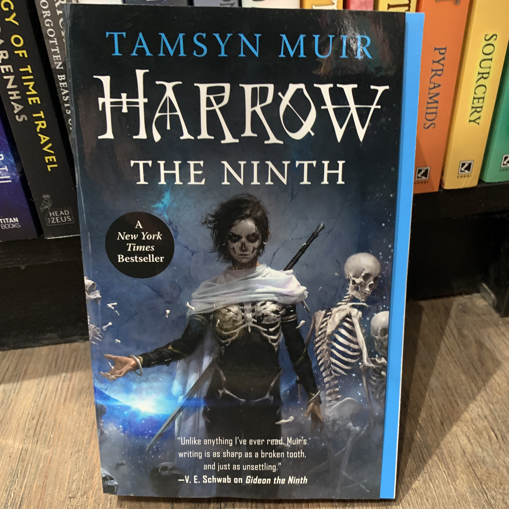

Dear Publishing Industry, I think you're great. You help form books and share stories and spread knowledge and record histories and all sorts of fabulous things. But I have a few questions and gripes about your cover design choices, and I think readers deserve answers.

For context, I have a degree that explored the publishing industry and featured considerations like marketing, typography and cover designer, and the trade publishing market. I know that there is 'logic' to most of the decisions made on the books. I know each book is an investment carefully considered and crafted to maximise its sales. I know that sometimes the best decision is not the popular decision. But even with all this in mind, there are certain things that frustrate me, and I will propose alternatives to each here.

First of all, the ultimate sin of cover design: the irremovable sticker. There is a certain appeal, a level of bragging involved in these. Often they are about an accomplishment by the book or author, such as an adaptation or an award. Fabulous, well done! Congratulations to all involved in getting the book to this point! Why does this require the maiming of the book? There are far more attractive, less intrusive methods of display; banners at the top, or actual stickers on it, or even a comment on a less obtrusive part of the book (inside or on the back cover, for example). Advertising stickers should not be placed in the same manner as actual stickers, defacing otherwise beautiful covers or mangle editions after the initial release. If it will forever be a part of the book, it needs the same consideration other parts of cover design do rather than the way you'd place an actual sticker.

Then we have the weird second-cover-flap. What even is that? Why is it there? A design feature for interest? An extra element like French flaps? A carry-over from American publishing still in the early stages of the product adoption and product life style?

Postulating its purpose, it may be for additional colour or to differentiate it from other books in attracting attention. From what I've heard, it just makes the actual front cover, with the art on it that the designer focused on, get damaged easier because it has been cropped. If you want a more eye-catching cover format element through colour, perhaps instead capitalise on the growing love for sprayed or decorated edges. Still colourful and attention grabbing without sacrificing size and practicality.

Finally, we have tone switching between editions. In the case of photographic film editions, it is easily explained by capitalising on the viewership to increase the readership. Or perhaps there is a book club edition if there is an endorsement or particular popularity in that area. But the change from the smooth black of the original *Hunger Games* trilogy to the neon atrocities, or the elegance of the hardback *Inheritance* series to the almost knock-off quality covers featuing parts of the dragons instead. Again, some can be excused as a rebranding of the book for a different audience demographic (such as the children's editions of Paolini's works), but many just take an element of the original and make it worse. Rather than continuing these odd shifts that are less appealling or suited to the book, perhaps basing the new covers on elements especially popular in fan art (in a respectful way) as a way of gauging what appeals to the fan base in order to retain fans and centre what has captured their attention, perhaps by focusing on a favoured character or object that has been reproduced by fandom. In this way cover redesigns can still be distinct to originals, be eye-grabbing in a pertinent way, and not have to take odd aesthetic choices unnecessarily. (Side note- please do not do this mid-series. It's very frustrating to have size and theme changes within a set.)