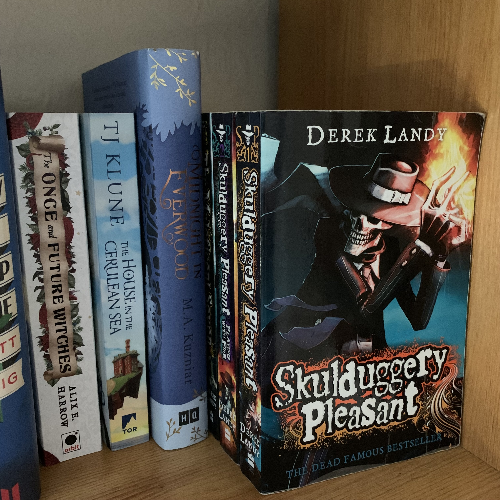

Unfortunately, books need space. It isn't possible to fit endless tomes on a bookcase, and leaving random stacks everywhere because of overflow is inviting danger. So, if you have limited shelf space, here are a few ways to make the most of your bookcase.

**Side Stacking**

This works best with books of the same size when the pile in question is taller than the spine's length. It capitalises on taller shelves and is the safer method of top stacking (resting a book on its cover on top of books shelved traditionally) to avoid the book on top getting bent by an uneven surface.

**Staggered Double Shelving**

Double stacking is often criticized for hiding the rear layer of books, but deeper shelves exist and no shelf space shold be wasted. The answer to to elevate the back books in some way, creating tiers of books. Egg boxes are the easiest method- three eggs deep is a great support for the 'standard' size paperback and lifts enough for the rear layer to be visible. (Be aware, hardbacks do not fit as neatly and this method works better if the back of the bookcase is all the same level. Warping is still possible if care is not taken.)

**Cover Out**

Again, this is to maximise space in deeper shelves. It also means beautiful cover art can be displayed rather than hidden. It uses the same principle as side stacking in being effective only if a stack is taller than the width of the book cover. This technique is used by bookshops who have a number of copies of the same book. It can also be used counteractively to make bookcases seem fuller by having a single book take up more width on shelf (extra books behind can be replaced by a small box to provide support).

**Bottom Stacking**

The danger of top stacking is the bending of books on an uneven surface. By creating a side stacked base layer, there is a way to maximise use of vertical space on bookcases. This can make it quite awkward to remove the base layer, and requires an even amount of pressure to keep the flat books in stable condition. Otherwise, this can be a viable shelving method.

**Add More Shelves**

This is a fairly obvious one. Some people have space for another book case or some wall-mounted shelves. Others can find it elsewhere in their homes. Alternative options may emerge, like trolley carts, wardobes, and windowsills. None seem ideal. But for many people, the space is taken by other more practical items. So how do we fix that? First, check if the shelves are adjustable. Can they be readjusted to add more by bringing them closer together? Second, build it out. Would it be feasible (and safe) to add extra shelving on top or off a side through an attachment? Finally, are you making the most of your top shelf? Is it book storage or is it decorative? Could it be both?

While we all wish books could be stored endlessly and aesthetically, hopefully these methods allow more storage with minimal compromise. There are doubtless other options people use to surround themselves with books, but these are all for keeping more on your bookcases. Just, before you put too many on them, check the weight capacity of those shelves first...